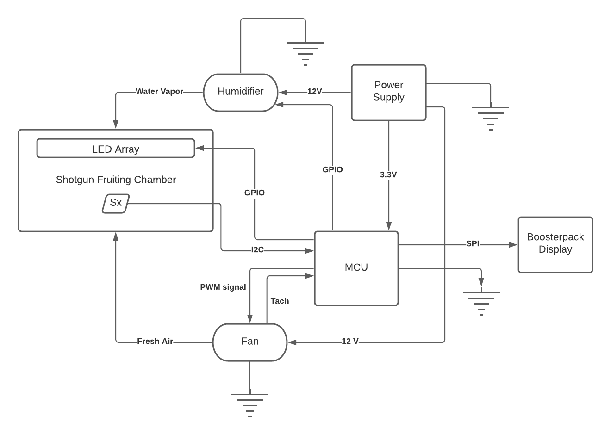

# Lesson 1 Assignment

## Invent an Imaginary Embedded System
>Tell us about an embedded system that does not exist. It can be grandiose or strange; it >can be something just one step beyond what you have around you. Ideally it is something >you personally want to build (even if physics doesn’t allow it). What is it? What does >it do? What general components do you need?

>This should be summarized in 3-6 sentences. A diagram would be nice but not required. Write your idea in a Google doc or a md file on Github and submit your assignment link to the #assignment-submission channel on Discord. Make sure your submission is publicly viewable.

# Assignment Submission

## Problem Statement
> Fungi are important species on this planet. They have been shown to have a lot of medicinal benifits for humans. In the near future where people are growing their own food, they also have small sustainable mushroom farms to grow and preserve some delicious variants like oyster mushrooms, or medicinal variants like Lions mane and Reishi.

> Fungi are probably the easiest thing to grow if a few things are taken care of. The farm is very easy to set up.
I found an easy to follow guide [here](https://learn.freshcap.com/growing/how-to-build-a-sgfc/).
We won't be requiring the spray bottle and Hygrometer as we will be using a humidifier and a humidity sensor to automate the climate inside the chamber.

## Shotgun Chamber Climate Controller
> To have a good yeild even from a small setup, fresh air and moisture is key to the rate of growth of Fungi. The humidity sensor will measure the current humidity inside the chamber. The humidifier is turned on until the threshold humidity inside the chamber is reached. Turning the humidifer off triggers the fan & the LED lights to turn on which helps in fresh air exchange & providing light to the fungi. The idea is to simulate a cyclic rain and sunny climate which helps in faster rate of growth of the fungi.
> Note : The light enables the fungi to grow in the upward direction. This results in longer stalks.

## High Level Block Diagram

## Main Components

MCU
- [MSP-EXP432P401R](https://www.ti.com/store/ti/en/p/product/?p=MSP-EXP432P401R)
- [Educational Booster pack MKII](https://www.ti.com/tool/BOOSTXL-EDUMKII?utm_source=google&utm_medium=cpc&utm_campaign=epd-msp-430-prodfolderdynamic-cpc-pf-google-wwe&utm_content=prodfolddynamic&ds_k=DYNAMIC+SEARCH+ADS&DCM=yes&gclsrc=ds&gclsrc=ds)

Sensors
- [Si7021 Temperature & Humidity Sensor](https://www.mouser.com/ProductDetail/Adafruit/3251?qs=sGAEpiMZZMvShe%252BZiYheinWRBTx8%252By8SsWOr%2FLad34g%3D)

LED lights
- [LED lights strips](https://www.aspectled.com/products/w-wide-5050-ultra-bright#led_light_color=173&led_strip_waterproofing=8&voltage=4) 

Humidifier
- [Reptile Humidifier](https://www.amazon.com/Coospider-Terrariums-Humidifier-Paludarium-Amphibians/dp/B07VVNP7F3/ref=sr_1_5?hvadid=241606705653&hvdev=c&hvlocphy=9061183&hvnetw=g&hvqmt=e&hvrand=17282112301090682498&hvtargid=kwd-2409851201&hydadcr=8874_10377090&keywords=reptile+humidifier&qid=1637260440&sr=8-5)

PWM Fan
- [Sanyo Denki 9GA0405P6F001](https://www.mouser.com/ProductDetail/Sanyo-Denki/9GA0405P6F001?qs=JgUGn%2FCSypzpGp8WAoItQg%3D%3D)

Power System
- Portable power bank
- [DC supply for fan](https://www.mouser.com/ProductDetail/TDK-Lambda/Z-U?qs=rEeOUHw6yBCFlIdRi%2FOw%2FA%3D%3D&mgh=1)
