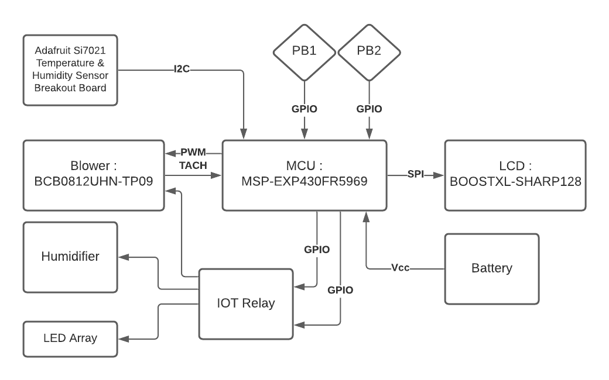
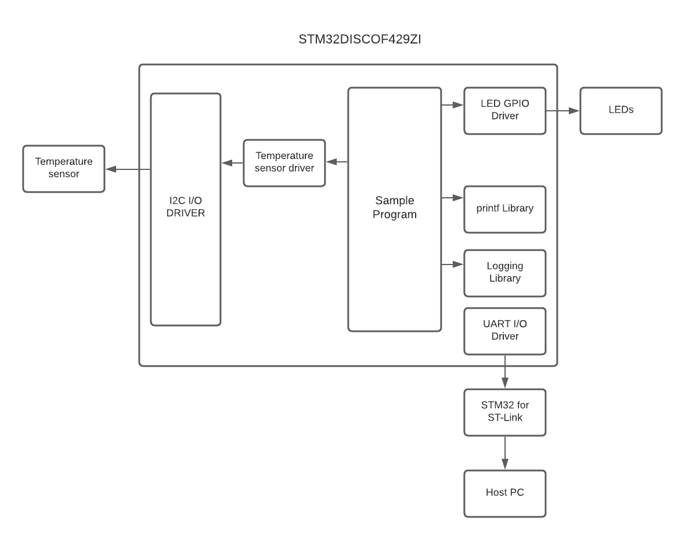

# Lesson 2 Assignment
## Exercise 2.1 : Idea Project Diagram
Make a block diagram describing an embedded system you'd like to have or make. Be imaginative. Reality doesn't apply here.
## Assignment Submission
The following is a modified version from Assignment 1.

## Exercise 2.2 : Read mbed code, make diagram
* Create a sign in and log into the mbed compiler
* Go to mbed platforms https://os.mbed.com/platforms/
* Select any platform (hint: search for a processor similar to the one you are considering
for your final project)
    - Read through the platform page
    - Add to Mbed Compiler (button on right)
    - Load a simple sounding template
    - Create a block diagram for this program, briefly explain why you chose the platform and template you did, be prepared to talk about this board in Live Class
## Assignment Submission
Selected Platform : STM DISCO-F429ZI
Selected Template : ADC_InternalChannels ( Used to read the raw temperature data from the sensors using ADC)
The following shows the relationship between the hardware and the software components :
