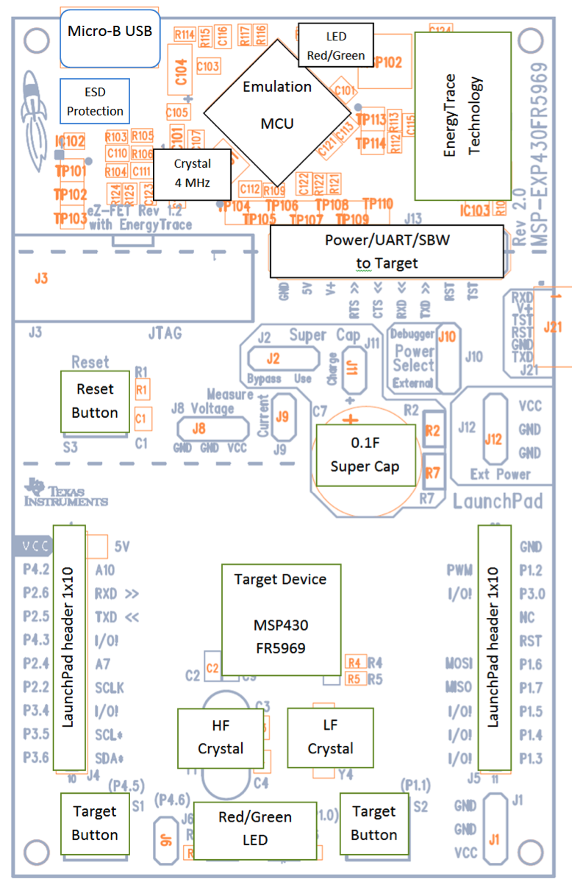
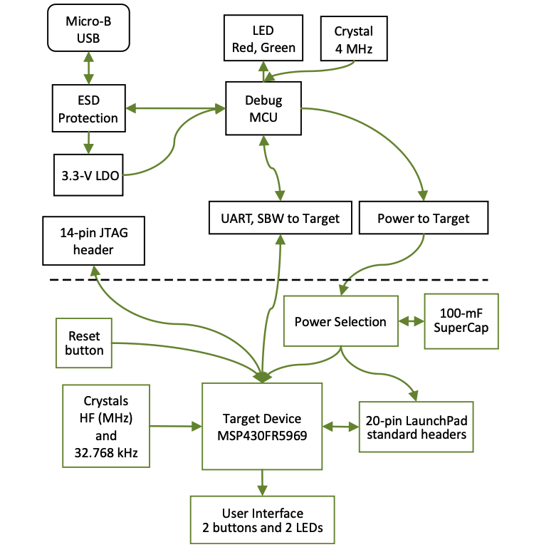

# Lesson 3 Assignment

## Exercise 3.1 : Investigate project board
The overview of launchpad is as follows:

The hardware block diagram is as follows:

Look at the datasheet for the processor and other documents. Answer these questions:
* What kind of processor is it?
    * MSP-EXP430FR5969 16 bit MCU
* How much Flash and RAM does it have? Any other memory types?
    * 64KB FRAM & 2KB SRAM
* Does it have any special peripherals? (List 3-5 that you noted as being interesting.)
    * Upto three serial interfaces (SPI, I2C or UART)
    * Digital: AES256, CRC, DMA, and hardware MPY32
* Does it have a floating point unit?
    * No
* If it has an ADC, what are the features?
    * Analog: 16-channel 12-bit differential ADC and 16-channel comparator

Look at one application note for this processor.

Low power application