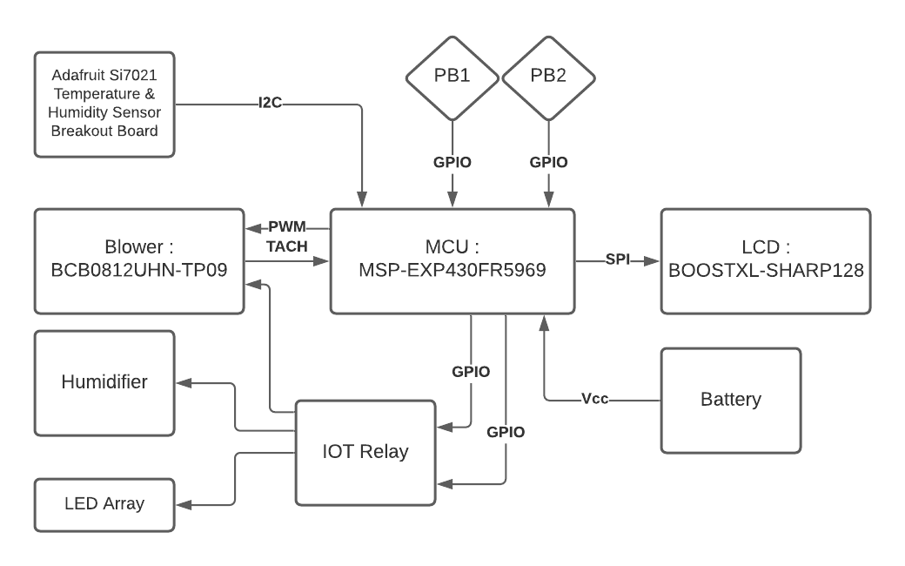

# Lesson 5 Assignment
>Start putting together a plan for your final project. Given the chapter, the main goal is to put together state machine documentation. This can be a flowchart or (preferably) a state table. You may also need to create the diagrams from Lesson 2 to flesh out the design. Note: this design planning, thinking through the system, what you have and what you need. Keep in mind that these will not be the final version!

The following is a block diagram of the final project from Lesson 2 :

> State Machine as a Data Table for the Low Powered Display

| States        | Action         | Sensor      | Humidifier | Fan      | LED Matrix | Button 1| Button 2 | TimeOut      |
|---------------|----------------|-------------|------------|----------|------------|---------|----------|--------------|
|START          | Splash Screen  | READ_DATA   |READ_STATUS|READ_PWM   |READ_STATUS |         |          |              |
|SCREEN1        | Screen1        | READ_DATA   |READ_STATUS|READ_PWM   |READ_STATUS |PRESSED  | RELEASED |              |
|SCREEN2        | Screen2        |             |           |READ_PWM   |            |RELEASED | PRESSED  |              |
|GET_TEMP       | Temp_data      | READ_DATA   |           |           |            |         |          | GET_TEMP     |
|GET_HUM        | Hum_data       | READ_DATA   |           |           |            |         |          | GET_HUM      |       
|FAN_STATE      | Fan_on_off     |             |           |READ_PWM   |            |         |          | FAN_STATE    |
|HUMD_STATE     | Humidf_on_off  |             |READ_STATUS|           |            |         |          | HUMD_STATE   |
|LED_STATE      | led_on_off     |             |           |           |READ_STATUS |         |          | LED_STATE    |
|FAN_PWM        | fan_pwm        |             |           |READ_PWM   |            |         |          | FAN_PWM      |
|SHUTDOWN       |                |             |           |           |            |         |          |              |